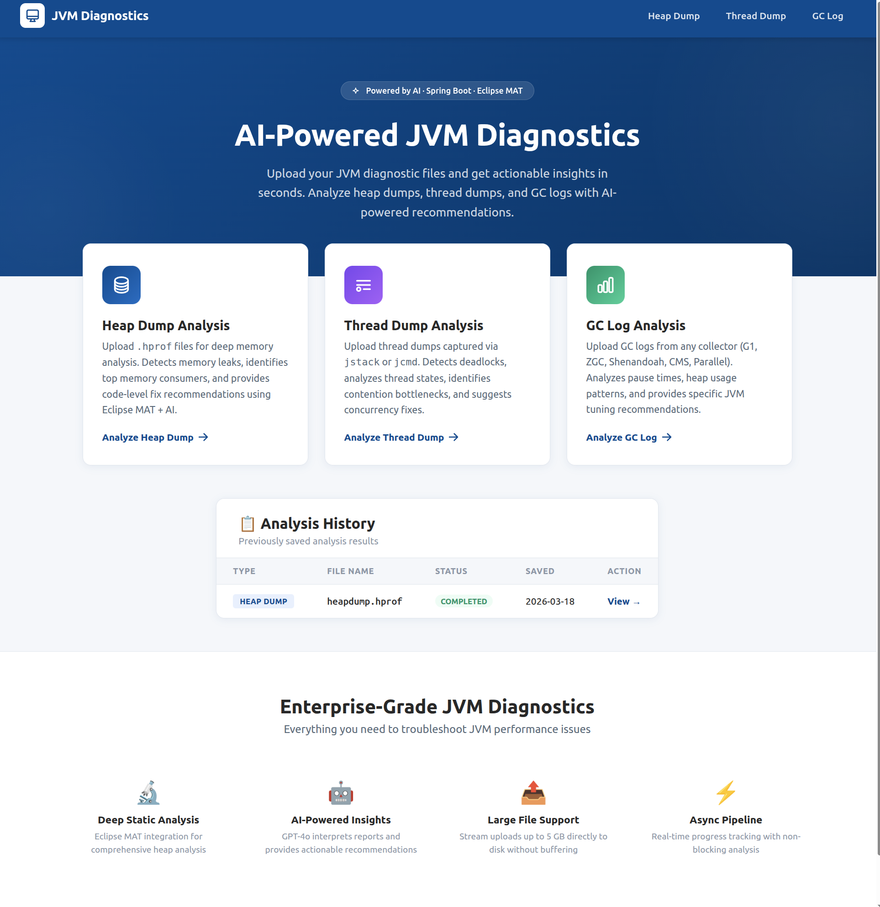
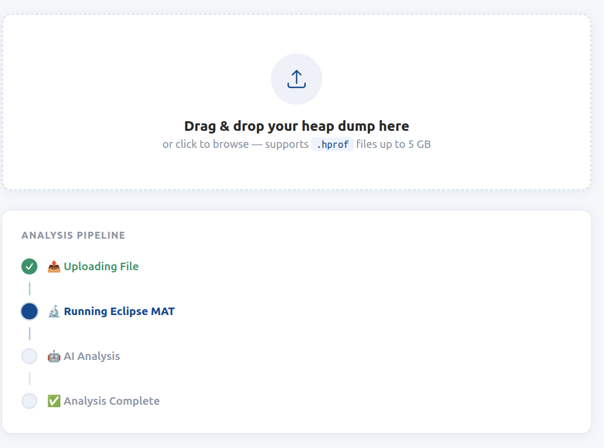
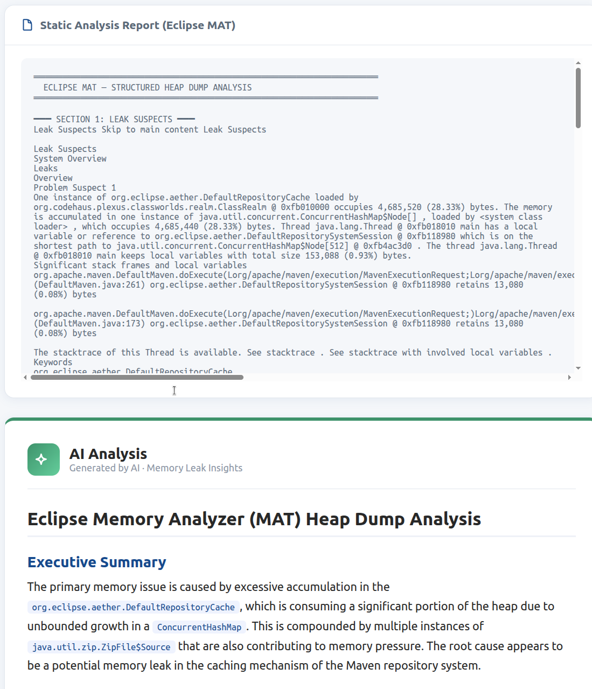

# 🔬 JVM Diagnostics Analyzer

AI-powered JVM diagnostics tool — analyze **heap dumps**, **thread dumps**, and **GC logs** with actionable insights from AI. Includes an **MCP server** for AI agent integration and a **built-in AI chat** for conversational heap dump analysis.

Built with **Spring Boot 4**, **Java 25**, **Eclipse MAT**, and **Spring AI**.

   

---

## Features

### 🔬 Heap Dump Analysis
- **Eclipse MAT integration** — Runs `ParseHeapDump.sh` headlessly to produce Leak Suspects reports
- **AI-powered insights** — GPT-4o interprets MAT reports for root-cause analysis and code-level fixes
- **Large file support** — Streams uploads up to 5 GB directly to disk

### 🧵 Thread Dump Analysis
- **Thread state parsing** — Extracts RUNNABLE, WAITING, BLOCKED, TIMED_WAITING distributions
- **Deadlock detection** — Automatically detects Java-level deadlocks
- **AI concurrency analysis** — Identifies contention bottlenecks and suggests concurrency fixes

### 📊 GC Log Analysis
- **Multi-collector support** — G1GC, ZGC, Shenandoah, CMS, Parallel, Serial
- **Pause time percentiles** — P50, P95, P99 analysis with anomaly detection
- **AI tuning recommendations** — Specific JVM flag suggestions and heap sizing advice

### 🔌 MCP Server (Model Context Protocol)
- **SSE-based MCP server** — Expose heap dump tools to any AI agent (Claude Desktop, Cursor, Windsurf, etc.)
- **7 analysis tools** — `get_heap_summary`, `get_leak_suspects`, `get_class_histogram`, `get_dominator_tree`, `get_top_consumers`, `run_oql_query`, `get_thread_stacks`
- **Live tool activity log** — Real-time visibility into agent tool calls on the MCP page

### 💬 Built-in AI Chat
- **Conversational heap dump analysis** — Ask questions in natural language on the MCP page
- **Real-time streaming** — Token-by-token LLM responses with automatic tool calling
- **Conversation memory** — Context maintained across messages via Spring AI `MessageChatMemoryAdvisor`
- **Collapsible debug info** — Inspect tool calls and parameters inline

### Common
- **Async pipeline** — Upload, analysis, and AI generation run asynchronously with live status polling
- **Modern UI** — Professional enterprise-grade design

---

## Screenshots

### Landing Page


### File Upload & Analysis Pipeline


### Analysis Result


---

## Prerequisites

| Requirement | Details |
|---|---|
| **Java 25** | Required for local builds |
| **Docker** | Required for the Docker-based setup |
| **OpenRouter API Key** | Get one at [openrouter.ai/keys](https://openrouter.ai/keys) |

---

## Quick Start with Docker (Recommended)

Docker is the easiest way to run the app because the image **bundles Eclipse MAT** automatically.

### Using Pre-built Image

No need to clone or build — just run:

```bash
docker run -d \
  --name jvm-diagnostics \
  -p 8080:8080 \
  -v jvm-uploads:/data/uploads \
  barishoku/jvm-dump-analyzer:latest
```

Open **http://localhost:8080** — you'll be guided through API key setup on first launch.

### Building from Source with Docker Compose

```bash
# 1. Clone the project
git clone https://github.com/bishoku/jvm-diagnostics-analyzer.git
cd jvm-diagnostics-analyzer

# 2. Configure your API key
cp .env.example .env
# Edit .env and set OPENROUTER_API_KEY=sk-or-your-key-here

# 3. Start the application
docker compose up --build
```

Open **http://localhost:8080** in your browser.

### Using Docker Run

```bash
docker build -t jvm-diagnostics .

docker run -d \
  --name jvm-diagnostics \
  -p 8080:8080 \
  -e OPENROUTER_API_KEY=sk-or-your-key-here \
  -v jvm-uploads:/data/uploads \
  jvm-diagnostics
```

### Building Multi-Platform Images

```bash
# Build for both amd64 and arm64 (e.g., for Docker Hub)
docker buildx create --use
docker buildx build \
  --platform linux/amd64,linux/arm64 \
  -t your-username/jvm-diagnostics:latest \
  --push .
```

### Docker Environment Variables

All settings can be overridden via environment variables:

| Variable | Default | Description |
|---|---|---|
| `OPENROUTER_API_KEY` | **(required)** | Your OpenRouter API key |
| `OPENROUTER_BASE_URL` | `https://openrouter.ai/api` | AI provider base URL |
| `AI_MODEL` | `openai/gpt-4o` | AI model to use |
| `AI_TEMPERATURE` | `0.3` | Response temperature |
| `MAX_FILE_SIZE` | `5GB` | Max upload file size |
| `MAX_REQUEST_SIZE` | `5GB` | Max HTTP request size |
| `FILE_SIZE_THRESHOLD` | `10MB` | Threshold before writing to disk |
| `APP_MAT_TIMEOUT_MINUTES` | `30` | Max time for MAT analysis |
| `JAVA_OPTS` | `-Xms512m -Xmx2g` | JVM options for the app |
| `SERVER_PORT` | `8080` | Application port |

---

## Running Locally (Without Docker)

If you prefer running outside Docker, you need Eclipse MAT installed for heap dump analysis. Thread dump and GC log analysis work without MAT.

### 1. Install Eclipse MAT (for heap dump analysis only)

Download the **standalone** version from [eclipse.org/mat](https://eclipse.dev/mat/downloads.php) and unzip it.

### 2. Set Environment Variables

```bash
export APP_MAT_HOME=/path/to/mat          # directory containing ParseHeapDump.sh
export OPENROUTER_API_KEY=sk-or-your-key-here
```

### 3. Build and Run

```bash
mvn spring-boot:run
```

Open **http://localhost:8080**.

---

## Usage

### Heap Dump Analysis

1. Navigate to **Heap Dump** from the landing page
2. Upload a `.hprof` file
3. Wait for Eclipse MAT analysis + AI insights
4. Review memory leak root causes and code-level fixes

### Thread Dump Analysis

1. Navigate to **Thread Dump** from the landing page
2. Upload a thread dump file (`.txt`, `.tdump`, `.log`) captured via `jstack` or `jcmd`
3. Wait for thread state parsing + AI analysis
4. Review deadlock detection, contention analysis, and concurrency recommendations

### GC Log Analysis

1. Navigate to **GC Log** from the landing page
2. Upload a GC log file (`.log`, `.txt`) from any JVM collector
3. Wait for pause time analysis + AI insights
4. Review GC tuning recommendations and heap sizing advice

### MCP Server (for AI Agents)

1. Navigate to **MCP** from the landing page
2. Upload a `.hprof` file — the MCP server starts automatically
3. Connect your AI agent to `http://localhost:8080/mcp/sse`
4. The agent can now call heap analysis tools directly

### Built-in AI Chat

1. Navigate to **MCP** from the landing page
2. Upload a `.hprof` file and wait for parsing
3. Use the chat panel at the bottom to ask questions about the heap dump
4. The AI streams responses in real-time, calling analysis tools as needed

---

## Project Structure

```
src/main/java/com/heapanalyzer/
├── HeapDumpAnalyzerApplication.java        # Entry point
├── config/
│   └── AsyncConfig.java                    # Thread pool for async analysis
├── controller/
│   └── AnalysisController.java             # REST API + UI routes
├── model/
│   ├── AnalysisState.java                  # Per-job state holder
│   ├── AnalysisStatus.java                 # Lifecycle enum
│   └── AnalysisType.java                   # HEAP_DUMP | THREAD_DUMP | GC_LOG
├── mcp/
│   └── HeapDumpMcpTools.java               # MCP tool definitions (7 tools)
└── service/
    ├── AnalysisService.java                # Async pipeline orchestrator
    ├── FileStorageService.java             # Stream-to-disk uploads
    ├── GcLogAnalysisService.java           # GC log parser
    ├── HeapDumpChatService.java            # AI chat with streaming & memory
    ├── MatAnalysisService.java             # Eclipse MAT subprocess
    ├── MatQueryService.java                # MAT headless query execution
    ├── McpSessionManager.java              # MCP session lifecycle
    ├── SpringAiService.java                # OpenAI via Spring AI
    └── ThreadDumpAnalysisService.java      # Thread dump parser

src/main/resources/templates/
├── index.html                              # Landing page (tool selection)
├── heap.html                               # Heap dump upload & results
├── thread-dump.html                        # Thread dump upload & results
├── gc-log.html                             # GC log upload & results
└── mcp.html                                # MCP server + AI chat page
```

---

## API Endpoints

| Method | Path | Description |
|---|---|---|
| `GET` | `/` | Landing page |
| `GET` | `/heap` | Heap dump analysis page |
| `GET` | `/thread-dump` | Thread dump analysis page |
| `GET` | `/gc-log` | GC log analysis page |
| `GET` | `/mcp` | MCP server + AI chat page |
| `POST` | `/api/heap/upload` | Upload `.hprof` file |
| `POST` | `/api/thread-dump/upload` | Upload thread dump |
| `POST` | `/api/gc-log/upload` | Upload GC log |
| `POST` | `/api/mcp/upload` | Upload `.hprof` for MCP |
| `POST` | `/api/mcp/chat` | AI chat (SSE stream) |
| `GET` | `/api/mcp/status` | MCP session status |
| `GET` | `/api/analysis/{id}/status` | Poll analysis status and results |

---

## How to Capture Diagnostic Files

### Heap Dump (.hprof)

```bash
# Using jcmd (recommended)
jcmd <PID> GC.heap_dump /path/to/heapdump.hprof

# Using jmap
jmap -dump:format=b,file=heapdump.hprof <PID>

# Automatic on OOM
java -XX:+HeapDumpOnOutOfMemoryError -XX:HeapDumpPath=/path/to/dumps/ -jar your-app.jar
```

### Thread Dump

```bash
# Using jstack
jstack <PID> > thread-dump.txt

# Using jcmd
jcmd <PID> Thread.print > thread-dump.txt

# Using kill signal (Unix)
kill -3 <PID>
```

### GC Log

```bash
# JDK 9+ (Unified Logging)
java -Xlog:gc*:file=gc.log:time,uptime,level,tags -jar your-app.jar

# JDK 8
java -verbose:gc -Xloggc:gc.log -XX:+PrintGCDetails -XX:+PrintGCDateStamps -jar your-app.jar
```

### From Docker / Kubernetes

```bash
# Docker
docker exec <container> jstack 1 > thread-dump.txt
docker exec <container> jcmd 1 GC.heap_dump /tmp/heapdump.hprof
docker cp <container>:/tmp/heapdump.hprof ./heapdump.hprof

# Kubernetes
kubectl exec <pod> -- jstack 1 > thread-dump.txt
kubectl exec <pod> -- jcmd 1 GC.heap_dump /tmp/heapdump.hprof
kubectl cp <pod>:/tmp/heapdump.hprof ./heapdump.hprof
```

---

## Tech Stack

| Technology | Version | Purpose |
|---|---|---|
| Java | 25 | Runtime |
| Spring Boot | 4.0.3 | Application framework |
| Spring AI | 2.0.0-M3 | AI integration, MCP server, chat memory |
| Eclipse MAT | 1.16.1 | Heap dump analysis |
| Thymeleaf | — | Server-side templating |

---

## License

[MIT](LICENSE)
